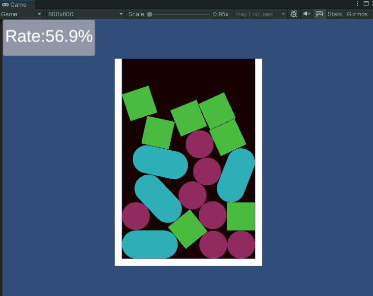

# 2Dパズルで背景に対して投下したブロックの面積占有率を計算するプロジェクト

## ヒエラルキー構成
* AreaManager（CreateEmpty） ← AreaManagerDynamic.cs
　- back(背景オブジェクト）← PolygonCollider2Dの所持が必要
* OjbGenerator (CreateEmpty) ← ObjGenerator.cs

## パズルブロックはプレハブ化 （OjbGenerator.csで順番に呼び出される）
* サンプルでは何種類かの図形 ← PolygonCollider2Dの所持が必要あり
